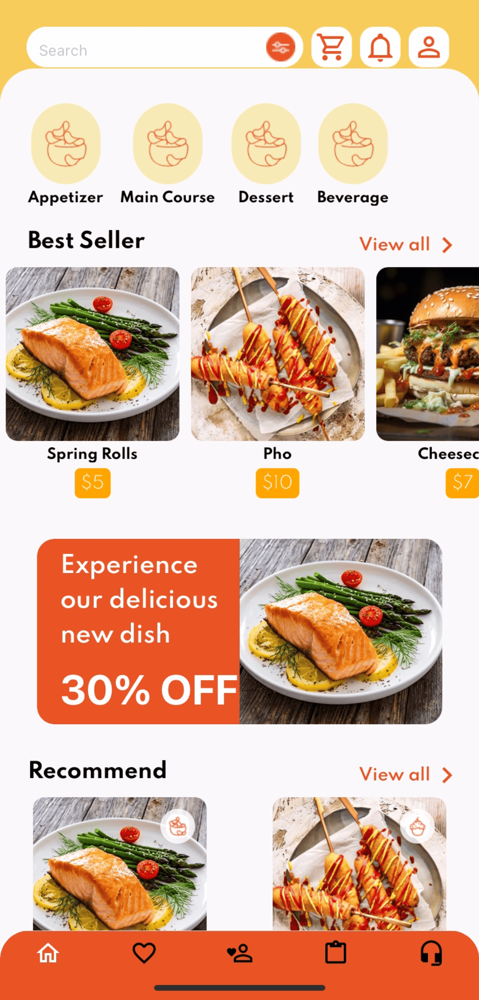
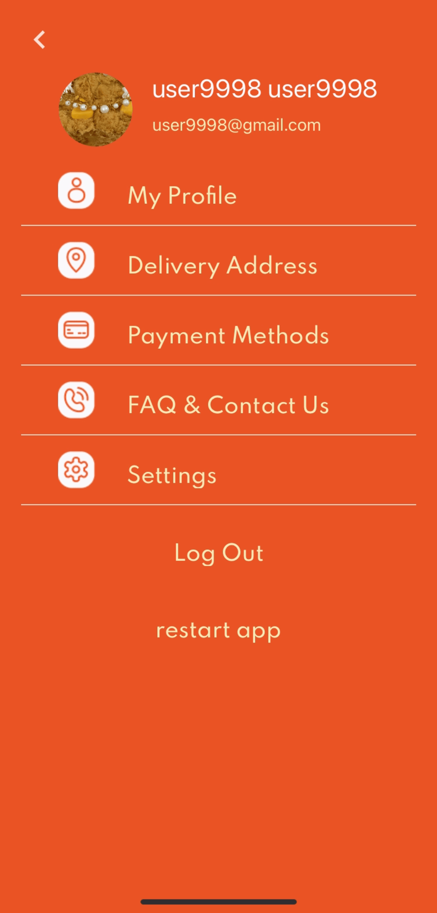
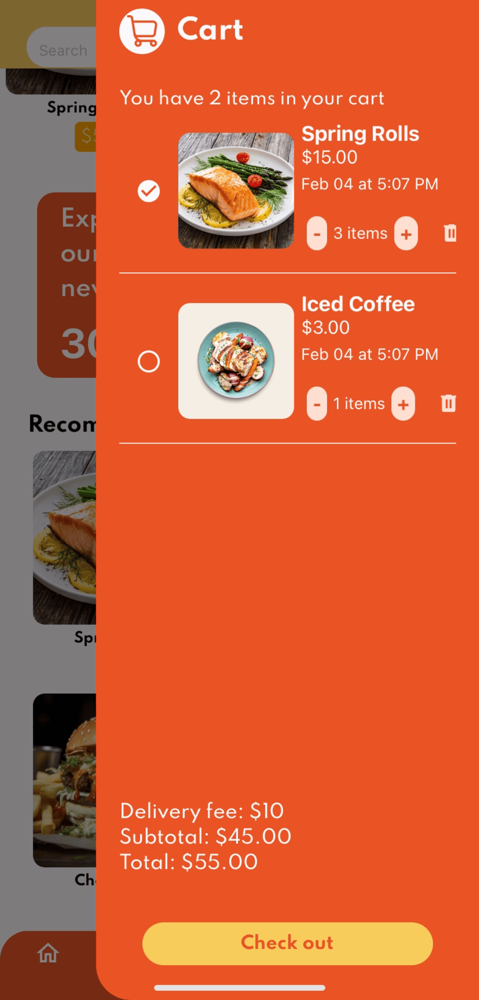
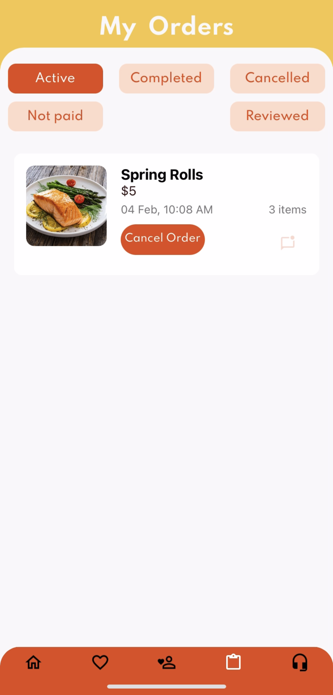
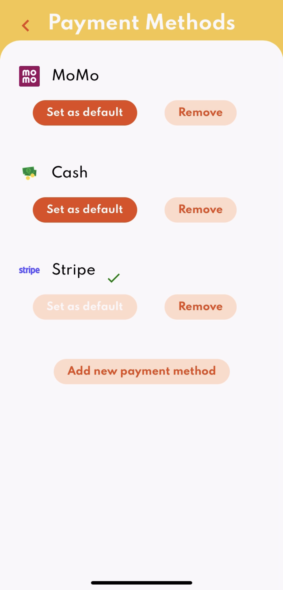
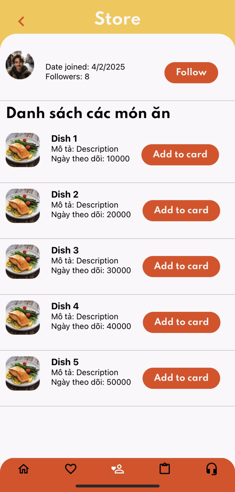

# FoodAppOu

A modern, cross-platform food delivery mobile application built with React Native and Expo. Connecting food lovers with their favorite restaurants through an intuitive and seamless ordering experience.

<div align="center">
    
</div>

## Skills & Technologies

<p align="center">
    
</p>

<p align="center">
    <a href="https://choosealicense.com/licenses/mit/">
        
    </a>
    <a href="https://expo.dev/">
        
    </a>
    <a href="https://reactnative.dev/">
        
    </a>
    <a href="https://www.typescriptlang.org/">
        
    </a>
    <a href="https://firebase.google.com/">
        
    </a>
</p>

## Features

### 🔐 Authentication & User Management

- **Firebase Authentication** with Google Sign-In integration
- Secure user registration and login
- Profile management and user preferences
- Password reset functionality

### 🍽️ Food Ordering System

- Browse restaurants and food categories
- Advanced search and filtering options
- Real-time menu updates
- Rating and review system
- Best seller recommendations

### 🛒 Shopping Cart & Checkout

- Add/remove items from cart
- Quantity management
- Multiple payment methods support
- Order tracking and history
- Delivery address management

### 📍 Location Services

- Delivery address selection
- Background location support

### 🎨 Modern UI/UX

- Beautiful, responsive design with TailwindCSS
- Dark/light mode support
- Smooth animations with Reanimated
- Touch gestures and haptic feedback
- Cross-platform compatibility (iOS, Android, Web)

### 🔧 Advanced Features

- Offline support with AsyncStorage
- Image uploading and management
- Store management system for vendors

## Tech Stack

### Frontend

- **React Native** 0.76.6 - Cross-platform mobile development
- **Expo** 52.0.28 - Development platform and SDK
- **TypeScript** 5.3.3 - Type-safe JavaScript
- **Expo Router** 4.0.15 - File-based navigation
- **NativeWind** 4.1.23 - TailwindCSS for React Native

### Backend & Services

- **Firebase** 11.2.0 - Authentication and backend services
- **Axios** 1.7.9 - HTTP client for API calls

### UI & Styling

- **TailwindCSS** 3.4.17 - Utility-first CSS framework
- **React Native Paper** 5.12.5 - Material Design components
- **React Native Vector Icons** 10.2.0 - Scalable icons
- **React Native SVG** 15.8.0 - SVG support

### Navigation & State Management

- **React Navigation** 7.0.14 - Navigation library
- **React Context API** - State management
- **AsyncStorage** 1.23.1 - Local data persistence

### Utilities & Tools

- **React Native Reanimated** 3.16.1 - Smooth animations
- **Expo Location** 18.0.4 - GPS and location services
- **React Native Gesture Handler** 2.20.2 - Touch gestures
- **Expo Image Picker** 16.0.5 - Camera and gallery access

## Installation & Setup

### Prerequisites

- Node.js (v18 or higher)
- npm or yarn
- Expo CLI
- iOS Simulator or Android Emulator (for testing)

### Quick Start

1. **Clone the repository**

   ```bash
   git clone <your-repository-url>
   cd FrontEnd_DiaDiemAnUong
   ```

2. **Install dependencies**

   ```bash
   npm install
   ```

3. **Set up environment variables**

   - Configure Firebase credentials in `firebaseConfig.tsx`
   - Update Google Services configuration files

4. **Start the development server**

   ```bash
   npx expo start
   ```

5. **Run on your preferred platform**
   - Press `i` for iOS simulator
   - Press `a` for Android emulator
   - Press `w` for web browser
   - Scan QR code with Expo Go app on your device

## Project Structure

```
FrontEnd_DiaDiemAnUong/
├── app/                          # Main application screens
│   ├── (home)/                   # Home module
│   │   ├── (tabs)/              # Tab navigation screens
│   │   ├── (cart)/              # Shopping cart screens
│   │   ├── (payment)/           # Payment screens
│   │   └── (settings)/          # Settings screens
│   ├── (store)/                 # Store management
│   └── (welcome)/               # Authentication screens
├── components/                   # Reusable components
│   ├── home/                    # Home-specific components
│   ├── store/                   # Store components
│   └── welcome/                 # Auth components
├── assets/                       # Static assets
│   ├── images/                  # App images and icons
│   └── fonts/                   # Custom fonts
├── configs/                      # Configuration files
├── styles/                       # Global styles and themes
└── screenshot/                   # App screenshots
```

## Development Scripts

```bash
# Start the development server
npm start

# Run on Android emulator
npm run android

# Run on iOS simulator
npm run ios

# Run on web browser
npm run web

# Run tests
npm test

# Lint code
npm run lint

# Reset project (remove example code)
npm run reset-project
```

## Building for Production

### Development Build with Custom Certificates

This project supports building iOS development builds with custom `.p12` and `.mobileprovision` files.

#### Setup Requirements

- Configure `credentials.json` with your certificate paths
- Ensure `eas.json` has correct build profiles
- Install development client:
  ```bash
  npx expo install expo-dev-client
  ```

#### EAS Build (Recommended)

```bash
# Install EAS CLI
npm install -g eas-cli

# Login to Expo
eas login

# Configure build
eas build:configure

# Build for iOS development
eas build --platform ios --profile development
```

#### Local Build

**Requirements:**

- macOS with Xcode installed
- iOS device connected to Mac
- Valid `.p12` and `.mobileprovision` files

```bash
# Create iOS build folder (Cancel device selection with Ctrl+C)
expo run:ios --device

# Open project in Xcode
open -a Xcode ios

# Configure signing in Xcode:
# 1. Disable "Automatically manage signing"
# 2. Import .p12 to Keychain
# 3. Import .mobileprovision to Xcode
# 4. Set certificate and provisioning profile for all targets

# Build and install on device
expo run:ios --device
```

#### Local APK/IPA Build

```bash
# Set Google Services path and build
export GOOGLE_SERVICES_JSON="/path/to/GoogleService-Info.plist" && eas build --profile development --platform ios --local
```

## Configuration

### Firebase Setup

1. Create a Firebase project at [Firebase Console](https://console.firebase.google.com/)
2. Enable Authentication with Google Sign-In
3. Add your iOS/Android app configurations
4. Download and place configuration files:
   - iOS: `GoogleService-Info.plist`
   - Android: `google-services.json`
5. Update `firebaseConfig.tsx` with your project credentials

### Environment Variables

- Configure build-specific environment variables in `app.config.js`
- Set up Google Services file paths for different build environments

## App Screenshots

<div align="center">
  
  
  
</div>

<div align="center">
  
  
  
</div>

## API Integration

The app integrates with various APIs and services:

- **Firebase Authentication** - User management and authentication
- **Firebase Firestore** - Real-time database for orders and user data
- **Google Places API** - Location services and restaurant discovery
- **Payment Gateway Integration** - Secure payment processing
- **Push Notifications** - Real-time order updates

## Contributing

We welcome contributions to FoodAppOu! Here's how you can help:

1. **Fork the repository**
2. **Create a feature branch**
   ```bash
   git checkout -b feature/amazing-feature
   ```
3. **Make your changes** and ensure code quality
4. **Run tests** and verify everything works
5. **Commit your changes**
   ```bash
   git commit -m 'Add some amazing feature'
   ```
6. **Push to the branch**
   ```bash
   git push origin feature/amazing-feature
   ```
7. **Open a Pull Request**

### Code Style Guidelines

- Follow TypeScript best practices
- Use ESLint and Prettier for code formatting
- Write meaningful commit messages
- Add tests for new features
- Update documentation as needed

## Troubleshooting

### Common Issues

**Metro bundler issues:**

```bash
# Clear Metro cache
npx expo start --clear
```

**iOS build issues:**

```bash
# Clean iOS build
npx expo run:ios --clear
```

**Android build issues:**

```bash
# Clean Android build
npx expo run:android --clear
```

**Firebase connection issues:**

- Verify configuration files are in the correct locations
- Check bundle identifiers match Firebase project settings
- Ensure API keys are correctly configured

## Performance Optimization

- **Image Optimization**: Uses Expo Image for efficient image loading and caching
- **Bundle Splitting**: Leverages Expo Router for code splitting
- **Caching**: Implements AsyncStorage for offline data persistence
- **Animations**: Uses Reanimated for smooth, native animations
- **Memory Management**: Proper cleanup of event listeners and subscriptions

## License

This project is licensed under the MIT License - see the [LICENSE](LICENSE) file for details.

## Acknowledgements

- [Expo](https://expo.dev/) - Amazing development platform
- [React Native](https://reactnative.dev/) - Cross-platform mobile framework
- [Firebase](https://firebase.google.com/) - Backend as a Service
- [TailwindCSS](https://tailwindcss.com/) - Utility-first CSS framework
- [NativeWind](https://www.nativewind.dev/) - TailwindCSS for React Native
- [React Navigation](https://reactnavigation.org/) - Navigation library

## Support

If you found this project helpful, please consider:

- ⭐ Starring the repository
- 🐛 Reporting bugs via Issues
- 💡 Suggesting new features
- 🤝 Contributing to the codebase

---

For more information about Expo development, visit the [Expo documentation](https://docs.expo.dev/).
